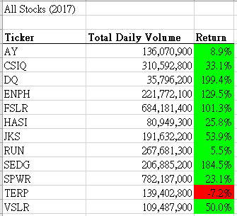
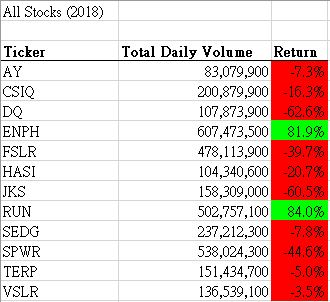

# Stock Analysis

## Overview of Project

### Purpose
- Steve wants to expand the dataset to include the entire stock market over the last few years.
- Although the VBA we did in [green_stocks.xlsm](green_stocks.xlsm) was working fine for a dozen stocks, it may not work as well for thousands of stocks, and it may take a long time to execute.
- Here I refactored the code to loop through all the data one time in order to collect the same information that we did before.
- Hopefully, the revised code [VBA_Challenge.xlsm](VBA_Challenge.xlsm) will take shorter execution time.

## Results


- Both the original and the refactored code generated the same stock performance results for 2017 and 2018.
- In 2017, **SPWR** had the highest 'Total Daily Volume', and **DQ** had the highest annual return.
- In 2018, **ENPH** had both the highest 'Total Daily Volume' and the highest annual return. 


- In terms of the execution time, the refactored code took 0.125s and 0.1132813s for running 2017 and 2018 data respectively.


- For the original code, it took 0.65625s and 0.6601563s for running the same sets of data.
- The refactored code obviously took shorter time to generate the results based on the same dataset.
- The main difference was in the looping logic:
1. In the original code, it loops through the same data for 12 times (once for each ticker).
2. In the refactored code, it loops through the data once only.
```
   'Original code
   '4) Loop through tickers
   For i = 0 To 11
       '5) loop through rows in the data
       For j = 2 To RowCount
           '5a) Get total volume for current ticker

           '5b) get starting price for current ticker

           '5c) get ending price for current ticker
       Next j
       '6) Output data for current ticker
   Next i
   
   'Refactored code
   '2b) Loop over all the rows in the spreadsheet.
    For i = 2 To RowCount  
        '3a) Increase volume for current ticker
        
        '3b) Check if the current row is the first row with the selected tickerIndex.
        
        '3c) check if the current row is the last row with the selected ticker   
    Next i
```

## Summary

### What are the advantages or disadvantages of refactoring code?

- Advantages:
1. Improve code efficency by taking fewer steps, using less memory, or improving the logic of the code.
2. Improve code readability and reduce complexity to make it easier for future users to read.

- Disadvantages: 
1. It is risky if the original code does not have proper test cases, the refactored code may have the same logical error that was copied from the original code. 
2. It is difficult and risky if you doesn't understand the original code

### How do these pros and cons apply to refactoring the original VBA script?

- The execution time of the refactored code is significantly improved by revising the loop logic.
- The revised code is more easier to understand, as it eliminated the unneccessary nested loop in the original code.
- As the origial code was well-tested, the risk of inheriting potential errors from the original code is minimal.


