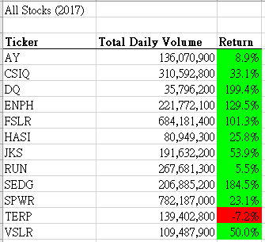
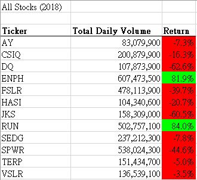
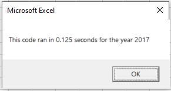
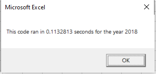
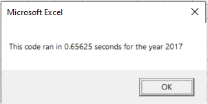
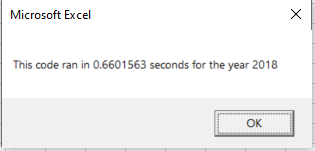

# Stock Analysis

## Overview of Project

### Purpose
- Steve wants to expand the dataset to include the entire stock market over the last few years.
- Although the VBA we did in [green_stocks.xlsm](green_stocks.xlsm) was working fine for a dozen stocks, it may not work as well for thousands of stocks, and it may take a long time to execute.
- Here I will refactor the code to loop through all the data one time in order to collect the same information that we did before.
- Hopefully, the revised code [VBA_Challenge.xlsm](VBA_Challenge.xlsm) will take shorter execution time.

## Results


- Both original code and the refactored code generated the same stock performance results for 2017 and 2018



- The refactored code took 0.125s and 0.1132813s for running 2017 and 2018 data respectively.




- When comparing with the execution time for the original code, it took 0.65625s and 0.6601563s for running the same sets of data.


What can you conclude about the Outcomes based on Goals?

It is more likely to have successful outcome if the Goal is less than $1000, or between $1000 to $1500.

- What are some limitations of this dataset?

1. The latest data was drawn from 2017, which is a little outdated. It is suggested to extract some recent data from the internet, in order to make the results more update-to-date.
2. It is assumed that the currency of the amount shown in the "Goals" is the same even the campaigns were took place from different countries. If not, the results would be totally different.   

- What are some other possible tables and/or graphs that we could create?

We may further filtering both graphs with the Country like GB or US, depending on where Louise is planning to perform the play, to make the results more country specific and realistic. 

## Summary

### Analysis of Outcomes Based on Launch Date

- We can see that the months of May and June both have a greater success rate.
- The months of May, Jun, Jul, Aug and Oct have similarly high number of failure rate.
- The canceled rate in January is the highest.
- Here is the link to [Kickstarter_Challenge.xlsx](Kickstarter_Challenge.xlsx).

### Analysis of Outcomes Based on Goals

- We can see the higher percentage of success for Goals in less than 1k, 1k-1.5k, 35k-40k, and 40k-45k (75.81%, 72.66%, 66.67%, 66.67%).  
- Higher percentage of failed for the Goals in 25k-30k, 45k-50k =, and over 50K (80%, 72.73%, 100%, 87.5%). 
- Here is the link to [Kickstarter_Challenge.xlsx](Kickstarter_Challenge.xlsx).

### Challenges and Difficulties Encountered
- One challenge is to setup `COUNTIFS` formulas in the sheet "Outcomes Based on Goals". By copy and paste the formulas to other columns without using absolute cell reference will require lots of updates in the formula. By adding absolute cell reference (using the shortcut **Fn-F4**), it makes my life easier!
``` 
=COUNTIFS(Kickstarter!D:D,">=5000",Kickstarter!D:D,"<=9999",Kickstarter!F:F,"successful",Kickstarter!R:R,"plays")
=COUNTIFS(Kickstarter!$D:$D,">=5000",Kickstarter!$D:$D,"<=9999",Kickstarter!$F:$F,"successful",Kickstarter!$R:$R,"plays")
```
- Another challenge is to reduce the Excel file size. The Excel file size is over 45M, and it is mainly due to too large of "used range" in the worksheet "Successful US Kickstarters" and "Failed US Kickstarters". I google the solution and find this https://www.excelefficiency.com/reduce-excel-file-size/#1_Remove_8220blank_space8221_in_your_sheets to describe how to clear the unneccessary "used range". Afterwards, the file size now reduce to under 3M!

